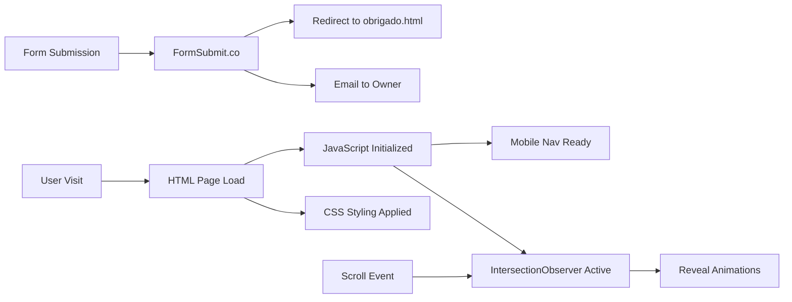

## Data Flow & Integrations

As a static website, data flow is minimal and primarily involves user interactions with forms and analytics tracking. No server-side data processing occurs within the codebase itself.

## Module Dependencies

- **HTML Pages** → `styles.css`, `main.js`
- **Service Pages** → `../styles.css`, `../main.js`
- **FinalRenamer** → `finalrenamer/styles.css`, `finalrenamer/script.js` (self-contained)

## Service Layer

This project has no backend services. External services handle specific functions:

- **FormSubmit.co** — Form data processing and email delivery
- **Google Fonts API** — Web font delivery
- **Analytics (dataLayer)** — Event tracking (optional)

## High-level Flow

## Internal Movement

1. **Page Load**: Browser requests HTML → CSS blocks rendering → JS enhances interactivity
2. **Scroll Events**: `IntersectionObserver` detects elements entering viewport → adds `.active` class → CSS animations trigger
3. **Form Submit**: User fills form → POST to FormSubmit.co → redirect to thank you page

## External Integrations

| Service | Purpose | Authentication | Payload |
|---------|---------|----------------|---------|
| FormSubmit.co | Contact form processing | Email-based endpoint | Form data (name, email, message) |
| Google Fonts | Web typography | None (public CDN) | Font requests |
| dataLayer | Analytics events | None | Custom event objects |

## Observability & Failure Modes

- **Form failures**: FormSubmit.co handles errors; users see their error page
- **Font loading**: `font-display: swap` ensures text remains visible during font load
- **JavaScript disabled**: Site remains functional; animations and mobile nav degrade gracefully
- **No server logs**: All observability relies on client-side analytics or third-party dashboards
